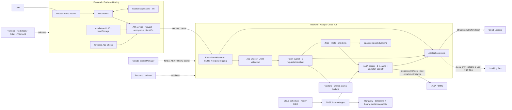

# Wildfire Tracker

## Introduction

Wildfire Tracker is a full-stack geospatial web application that displays recent satellite-detected fire activity across the Iberian Peninsula. It combines a React map interface with a FastAPI service that retrieves near-real-time observations from NASA FIRMS.

The project demonstrates API design, third-party data integration, cloud deployment, CORS configuration, asynchronous UI state, and interactive geospatial visualization.

## Deployed URLs

- **Web application:** [Firebase Hosting](https://project-d66d4e5f-ee28-4c77-845.web.app/)
- **REST API:** [Google Cloud Run](https://wildfire-api-440479996053.europe-west1.run.app/)
- **Interactive API documentation:** [Swagger UI](https://wildfire-api-440479996053.europe-west1.run.app/docs)

## Features

- Interactive Leaflet map centered on the Iberian Peninsula
- Recent wildfire detections sourced from NASA FIRMS
- Detection details including date, time, satellite, confidence, and fire radiative power
- Responsive React interface hosted on Firebase
- REST API hosted as a containerized service on Google Cloud Run
- Configurable observation window and aggregate statistics
- Explainable spatiotemporal grouping into possible fire clusters
- Switchable detection and cluster layers with aggregate FRP insights
- Two-hour browser cache with an explicit manual refresh action
- Shared five-request token bucket per anonymous browser installation
- Exponential NASA retry backoff when a cold API instance has no cached data
- Stale-if-error fallback that keeps the last map visible with its data age

## Architecture



The frontend and API deploy independently. A manual refresh bypasses the
two-hour browser cache, but never the backend's one-hour NASA protection
window. The NASA cache and refresh lock remain process-local, while Firestore
shares rate-limit state across Cloud Run instances. React and FastAPI correlate
requests with `X-Request-ID`; a separate installation UUID is HMAC-hashed before
it becomes a Firestore key. Logs exclude UUIDs, payloads, coordinates, visitor
IPs, and secret values. Production logs go to Cloud Logging; bounded rotating
files are used only during local development.

## Tech Stack + Why

- **React:** component-driven UI and predictable state updates when users change the observation window.
- **Vite:** fast local development and a lightweight optimized production build.
- **React Leaflet / Leaflet:** mature, open-source tools for interactive geospatial visualization.
- **FastAPI:** typed query validation, automatic OpenAPI documentation, and concise REST endpoint development.
- **Pandas:** convenient parsing and transformation of the CSV responses returned by NASA FIRMS.
- **NASA FIRMS:** authoritative near-real-time satellite fire-detection data.
- **Firebase Hosting:** simple, globally distributed hosting for the static frontend.
- **Firebase App Check:** attests that public API requests originate from the deployed web application.
- **Cloud Firestore:** provides atomic, shared token buckets across stateless Cloud Run instances.
- **Google Cloud Run:** managed, scalable hosting for the Python API with environment-based secret configuration.
- **Secret Manager:** keeps the NASA key outside source code and literal Cloud Run environment values while preserving the established `NASA_KEY` runtime interface.
- **BigQuery:** stores partitioned, one-year analytical history without putting the public map on a data-warehouse dependency.
- **Cloud Scheduler:** triggers one authenticated, idempotent ingestion each hour.

## Logging and Request Correlation

The API uses structured, privacy-conscious logging. Every React request sends a
fresh `X-Request-ID`; FastAPI validates it, returns it in the response, and adds
it to related HTTP, cache, rate-limit, and NASA access events. This makes one
browser/API interaction traceable without storing visitor IP addresses, request
bodies, fire coordinates, response payloads, or the secret-bearing NASA URL.

In local development, readable UTC-timestamped logs are written to
`backend/logs/wildfire-api.log`. The active file rotates at 5 MiB and retains
19 backups (`.log.1` through `.log.19`), bounding the default footprint to
approximately 100 MiB. On the next rotation, the oldest backup is deleted.
The entire directory is excluded from Git.

Cloud Run does not use local log files because its writable filesystem is
ephemeral. Production emits one structured JSON object per line to `stdout`,
which Cloud Run collects in Cloud Logging. The deployed service obtains
`NASA_KEY` through a versioned Secret Manager reference rather than a literal
environment value. The following non-secret environment variables control the
logging behavior without code changes:

| Variable | Local default | Purpose |
| --- | --- | --- |
| `LOG_LEVEL` | `INFO` | Minimum application severity |
| `LOG_TO_FILE` | `true` locally, `false` on Cloud Run | Enable the rotating file handler |
| `LOG_FILE_PATH` | `backend/logs/wildfire-api.log` | Override the local destination |
| `LOG_MAX_BYTES` | `5242880` | Rotate after approximately 5 MiB |
| `LOG_BACKUP_COUNT` | `19` | Rotated backups retained (20 files including the active log) |

Log fields are allowlisted and control characters are neutralized to prevent
log injection. The NASA key is defensively redacted at the formatter boundary,
and upstream failures record only their exception type rather than their URL or
message. If an API error reaches React, its JavaScript `Error` carries the same
`requestId` shown in the server log.

## Local Development

Create `backend/.env` and provide a valid NASA FIRMS key:

```env
NASA_KEY=your_nasa_firms_key
# Optional locally; production receives a separate value from Secret Manager.
CLIENT_ID_HASH_SECRET=replace_with_a_random_secret
```

Start the API:

```bash
cd backend
pip install -r requirements.txt
uvicorn main:app --reload
```

Start the frontend in a separate terminal:

```bash
cd frontend
npm install
npm run dev
```

Without the public Firebase settings in `frontend/.env.example`, local
development sends the installation UUID but deliberately skips App Check;
Cloud Run requires a valid token. Local App Check testing must use Firebase's
debug-token workflow rather than registering `localhost` on the production
reCAPTCHA key.

`CLIENT_ID_REQUIRED` and `APP_CHECK_REQUIRED` are temporary rollout controls.
Both remain enabled in the final production configuration; they may be disabled
only while an older frontend is being replaced.

## API Overview

```http
GET /
GET /fires?days=1
GET /fires?days=3
GET /fires?days=5
GET /fires?days=3&refresh=true
GET /stats?days=1
GET /incidents?days=3
GET /incidents?days=3&refresh=true
POST /internal/ingest
```

Using a `days` query parameter keeps the resource-oriented API extensible and avoids creating separate endpoints for every supported time window.

Setting `refresh=true` explicitly bypasses browser-held data, but it does not bypass the API's one-hour NASA protection window. Concurrent cache misses are coalesced so only one request per API instance reaches NASA.

Each browser installation creates one random UUID in versioned `localStorage`
and sends it as `X-Client-ID`. FastAPI accepts canonical UUIDs only, converts
them to an HMAC-SHA256 key using a Secret Manager value, and never logs the UUID
or visitor IP. Firebase App Check is additionally required in Cloud Run through
`X-Firebase-AppCheck`; this validates the calling application, not a person's
identity.

Firestore stores an atomic token bucket per HMAC key with five tokens and a
refill rate of one token every 12 seconds. All API instances therefore share a
five-request-per-minute sustained limit, while a wider in-memory guard protects
each instance if Firestore is unavailable. Rejections return `429 Too Many
Requests` with `Retry-After`. A continuously active client can consume up to
7,200 accepted writes per day; the free Firestore allowance is 20,000 writes
and 50,000 reads per day, so usage must be monitored as traffic grows.

If NASA is temporarily unavailable after the one-hour cache window expires, the API preserves the last successful dataset instead of emptying the map. `X-Data-Stale` and `X-Data-Age-Seconds` response headers let the React client show a visible age warning while keeping the established JSON response shapes unchanged. A cold instance with no cached dataset retries NASA after 1, 2, 4, and 8 minutes, then caps the exponential backoff at 15 minutes until a request succeeds.

## Intelligent Fire Clustering

The optional cluster layer turns nearby satellite observations into possible
fire areas. Two detections are connected when they occur within **2 km** and
**24 hours** of one another; transitive connections form one component. The
implementation uses the Haversine distance and a Union-Find data structure, so
the method remains lightweight and explainable without adding a machine-learning
runtime to the Cloud Run image.

Each possible cluster reports its geographic center, detection count, aggregate
and peak FRP, observation span, dominant confidence category, and a simple FRP
trend. Stable identifiers are derived from source observations, allowing clients
to track the same group when response ordering changes.

The cluster response also includes the exact source detections used by each
group and a convex observation envelope with a 1 km context buffer. The frontend
draws that translucent envelope behind the original FRP-sized points, so no
synthetic centroid replaces or obscures the underlying observations. The
envelope is an explainable visualization aid, not a measured burned perimeter.

Clusters, severity colors, and trends are analytical aids. They are **not
confirmed wildfire incidents, emergency classifications, or forecasts**.

## Historical Analytics

An OIDC-authenticated Cloud Scheduler job calls the private
`POST /internal/ingest` route at minute 5 of every UTC hour. The route accepts
only the configured scheduler service account, requires a fresh 24-hour NASA
dataset, and never participates in public map requests.

The regional `wildfires` BigQuery dataset contains two one-year, daily
partitioned tables. `fire_detections` deduplicates physical observations using
a deterministic SHA-256 ID. `fire_clusters` stores idempotent hourly snapshots,
including their boundary and member detection IDs. Every detection points to
its latest `(cluster_id, cluster_snapshot_at)` snapshot; isolated detections
also receive a one-member cluster. BigQuery does not enforce key constraints,
so both table updates and the orphan check run in one transaction.

Queries require partition filters and each ingestion job is capped at 50 MiB
scanned. Before writing, the API reads table metadata and stops ingestion at
8 GiB of logical storage. This keeps a safety margin below the current 10 GiB
storage allowance; one hourly job also remains far below the 1 TiB monthly
query allowance. BigQuery failures are logged but do not interrupt `/fires`,
`/stats`, or `/incidents`.

Example analytical query:

```sql
SELECT severity, COUNT(*) AS snapshot_count
FROM `project-d66d4e5f-ee28-4c77-845.wildfires.fire_clusters`
WHERE snapshot_date >= DATE_SUB(CURRENT_DATE(), INTERVAL 7 DAY)
  AND status = 'active'
GROUP BY severity
ORDER BY snapshot_count DESC;
```

Production configuration uses `BIGQUERY_ENABLED`, `BIGQUERY_PROJECT_ID`,
`BIGQUERY_DATASET`, `BIGQUERY_LOCATION`, `BIGQUERY_MAX_BYTES_BILLED`,
`BIGQUERY_STORAGE_GUARD_BYTES`, `SCHEDULER_SERVICE_ACCOUNT`, and
`SCHEDULER_AUDIENCE`. The schema is versioned in
`backend/sql/create_bigquery_schema.sql`.
