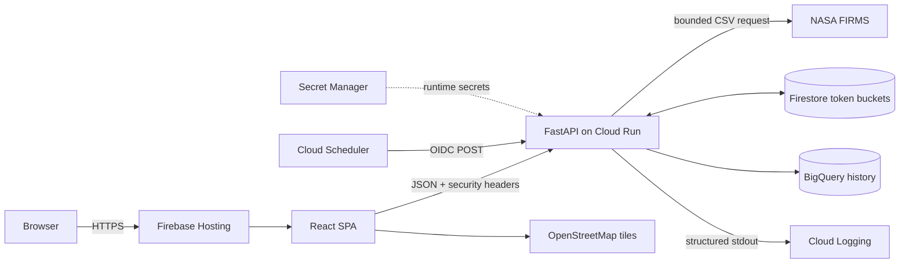
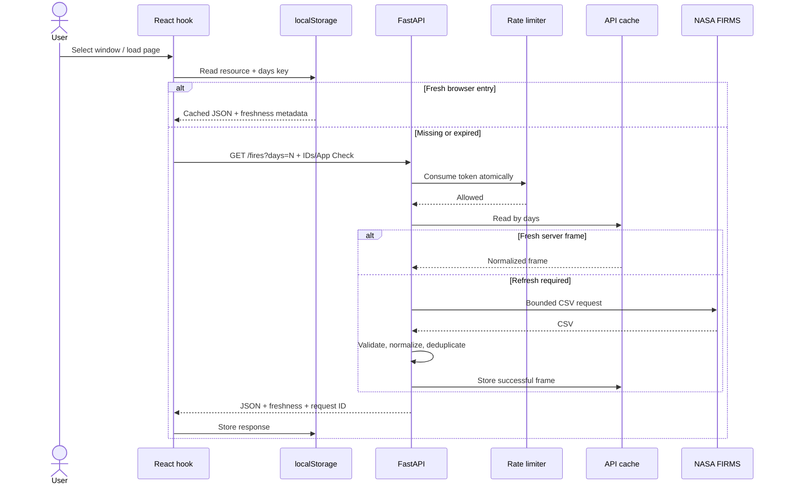

# Wildfire Tracker Architecture

## 1. Purpose and scope

Wildfire Tracker displays recent NASA FIRMS thermal detections over the Iberian
Peninsula and derives explainable groups of nearby observations. It consists of
an independently deployed React single-page application and a FastAPI API.

The system is designed for a public portfolio application with conservative
free-tier usage. Its priorities are:

- keep the map available when NASA has a temporary outage;
- prevent browsers from receiving the NASA API key;
- bound untrusted upstream payloads and cloud costs;
- make clusters explainable from their source detections;
- keep public reads independent from the analytical warehouse;
- correlate failures without logging visitor identities or fire coordinates.

The product is not an emergency-alert system. Clusters and their envelopes are
analytical context, not confirmed incidents, forecasts, or burned-area maps.

## 2. System context



Firebase and Cloud Run deploy independently. BigQuery is an analytical sink;
the public map never reads from it and remains operational if ingestion fails.

## 3. Runtime containers and components

### 3.1 Frontend

| Component | Responsibility |
| --- | --- |
| `App.jsx` | Composition root for observation window, active layer, selection, refresh, notices, map, and data explorer. |
| `components/` | Presentational and interaction boundaries such as controls, map, summaries, errors, privacy information, and accessible data exploration. |
| `useFireData` | Detection state, request cancellation, browser-cache reads/writes, freshness, and latest-request-wins behavior. |
| `useIncidentData` | Lazy cluster loading with the same cancellation and cache semantics. Clusters are not fetched until requested. |
| `fireApi.js` | HTTP contract, query construction, response-shape checks, freshness headers, request IDs, and typed client errors. |
| `requestSecurity.js` | Adds the anonymous installation ID and Firebase App Check token. |
| `cacheStorage.js` | Defensive versioned `localStorage` adapter; storage failure never makes fresh data unusable. |
| Domain presentation modules | Convert confidence, FRP, age, severity, and identities into stable UI representations. |

The frontend uses React 19, Vite, React Leaflet, and Leaflet. Firebase Hosting
serves the compiled static files and rewrites application routes to `index.html`.
During local development Vite proxies `/api` to `127.0.0.1:8000`.

### 3.2 Backend

| Component | Responsibility |
| --- | --- |
| `main.py` | FastAPI composition root, routes, CORS, request-ID middleware, and freshness headers. |
| `nasa_client.py` | Bounded HTTP transport: timeouts, content-type checks, streamed byte limit, row limit, and CSV parsing. |
| `fire_data_validation.py` | Required schema, coordinates/time validation, normalization, deterministic deduplication, quality flags, and aggregate quality metrics. |
| `fire_data.py` | NASA access policy, process cache, refresh coalescing, stale-if-error, and cold-start exponential backoff. |
| `incident_clustering.py` | Haversine distance, time-aware connected components, FRP summaries, trends, and buffered convex envelopes. |
| `client_identity.py` | Canonical UUID validation and HMAC-SHA256 pseudonymous Firestore key generation. |
| `firebase_security.py` | Firebase App Check verification for production callers. |
| `rate_limit.py` | Rate-limit policy and local outage guard. |
| `rate_limit_store.py` | In-memory and Firestore token-bucket storage adapters. |
| `historical_ingest.py` | Scheduler-only application service for one fresh, hourly analytical snapshot. |
| `historical_models.py` | Pure deterministic transformation into detection facts and cluster snapshots. |
| `bigquery_repository.py` | Cost/storage/payload guards, bound query parameters, relationship checks, and query execution. |
| `bigquery_sql.py` | Cached SQL resource loading and allowlisted identifier substitution. |
| `backend/sql/` | Reviewed DDL, migration, lookup, and atomic history `MERGE` statements. |
| `logging_config.py` | Structured Cloud Logging output, bounded local rotation, redaction, and log-injection protection. |

### 3.3 Managed services and storage

| Service | Data or responsibility | Persistence |
| --- | --- | --- |
| Browser `localStorage` | Public detection/cluster responses and anonymous installation UUID | Per browser; user-clearable |
| Cloud Run memory | NASA frames, refresh locks, failure backoff, local limiter fallback | Per instance; ephemeral |
| Firestore | HMAC-keyed shared token-bucket state (`tokens`, refill time, expiry marker) | Shared across API instances |
| BigQuery | Deduplicated detections and hourly cluster snapshots | One-year partition retention |
| Cloud Logging | Structured production application events | Managed retention |
| Local rotated file | Development logs at `backend/logs/wildfire-api.log` | About 100 MiB maximum by default |
| Secret Manager | `NASA_KEY` and client-ID HMAC secret | Versioned managed secrets |

## 4. Architectural patterns

### Composition roots and explicit boundaries

`App.jsx` and `main.py` assemble their applications. Networking, storage,
validation, domain derivation, and persistence remain in focused modules. This
keeps UI components and route functions thin and allows external systems to be
replaced with mocks in tests.

### Ports and adapters

Firestore and BigQuery are accessed through adapters rather than from domain
logic. `historical_models.py` performs pure transformations, while
`bigquery_repository.py` owns persistence. `rate_limit_store.py` supplies both
shared Firestore and local in-memory implementations.

### Cache-aside with stale-if-error

The browser checks its two-hour cache before calling the API. The API checks a
one-hour process-local NASA cache before calling NASA. Expired successful data
is retained and may be served with explicit stale headers if refresh fails.
This favors an old but labelled map over an empty map.

### Single-flight refresh

A process lock coalesces concurrent cache misses. The first request refreshes;
waiting requests re-check the cache after the lock and reuse its result. This
protects NASA within one API instance but is not a distributed lock.

### Token bucket

Each browser installation has a five-token bucket refilled at one token every
12 seconds. A Firestore transaction makes consumption atomic across Cloud Run
instances. A wider in-memory bucket is a fail-safe when Firestore is unavailable.

### Boundary validation and canonicalization

NASA is treated as untrusted input. Transport size is bounded before parsing;
required columns, geographic bounds, observation time, finite numbers, text
length, and row count are checked before data enters the cache. Invalid FRP is
represented as `null`; unusually high but finite FRP is retained and flagged.
Only aggregate quality counts are logged.

### Idempotent analytical ingestion

Detection IDs are deterministic SHA-256 values derived from immutable source
fields. Cluster snapshots use UTC hour keys. Scheduler retries therefore update
the same logical records instead of duplicating them. Both BigQuery `MERGE`
operations execute in one transaction.

### Parameterized SQL with constrained identifiers

Row data always uses BigQuery query parameters. BigQuery cannot parameterize
table identifiers, so `bigquery_sql.py` substitutes only expected template
markers after validating the complete resource path. SQL files cannot select
arbitrary resources or accept a general template expression.

### Correlation without user tracking

React creates a UUID per request in `X-Request-ID`. FastAPI validates or replaces
it, returns it, and attaches it to internal events. The stable browser UUID used
for rate limiting is separate, HMAC-hashed before storage, and never logged.

## 5. Public and internal contracts

### 5.1 HTTP API

| Route | Access | Input | Output |
| --- | --- | --- | --- |
| `GET /` | Public, not rate limited | None | Lightweight health message |
| `GET /fires` | App Check + client rate limit in production | `days=1..10`, optional `refresh` | Array of detection objects |
| `GET /stats` | App Check + client rate limit in production | `days=1..10` | Count, FRP aggregates, satellite counts |
| `GET /incidents` | App Check + client rate limit in production | `days=1..10`, optional `refresh` | `IncidentCollection` |
| `POST /internal/ingest` | Exact Scheduler service-account OIDC token | No public body | Ingestion counts and snapshot timestamp |

`POST /internal/ingest` is omitted from OpenAPI. Browser CORS allows only the
configured localhost and Firebase origins and public `GET` calls. CORS is a
browser policy, not an authentication mechanism.

### 5.2 Detection contract

```json
{
  "latitude": 42.1,
  "longitude": -8.6,
  "confidence": "n",
  "acq_date": "2026-09-27",
  "acq_time": 930,
  "satellite": "N20",
  "frp": 12.4
}
```

`frp` may be `null` when NASA supplies an invalid, negative, or non-finite
value. Internal `quality_flags` are deliberately removed from `/fires`; they
are analytical metadata rather than a public response-contract change.

### 5.3 Incident contract

`IncidentCollection` contains `days`, `incident_count`, `generated_at`, and an
`incidents` array. Each incident contains:

- a stable response ID, center, and polygonal observation envelope;
- every original normalized detection used by the component;
- detection count, total/maximum FRP, and observation interval;
- confidence, trend, and severity labels.

The polygon is required to contain at least three points and detections remain
visible individually on the map.

### 5.4 Request and response headers

| Header | Direction | Contract |
| --- | --- | --- |
| `X-Request-ID` | Both | Canonical per-request UUID used for correlation |
| `X-Client-ID` | Request | Canonical UUIDv4 identifying a browser installation |
| `X-Firebase-AppCheck` | Request | Firebase attestation token required by Cloud Run configuration |
| `X-Data-Stale` | Response | `true` when the API served an expired successful NASA frame |
| `X-Data-Age-Seconds` | Response | Non-negative approximate age of the server dataset |
| `Retry-After` | Response | Backoff for `429` and applicable temporary `503` responses |

No request body, visitor IP, raw client ID, App Check token, NASA URL, payload,
or coordinate is part of the logging contract.

### 5.5 Cache contract

- Browser entries are namespaced/versioned by resource and `days` value.
- Browser TTL is two hours; malformed or expired entries are ignored.
- API cache is keyed by `days` with a one-hour TTL.
- `refresh=true` bypasses browser storage but never bypasses API NASA protection.
- Stale responses keep the normal JSON shape and communicate age via headers.
- With no prior frame, NASA failures use 1, 2, 4, and 8 minute retries capped at
  15 minutes.

### 5.6 BigQuery contract

`wildfires.fire_detections` stores one row per deterministic observation. It is
partitioned by `observation_date`, clustered by cluster and satellite, and
retained for one year. Invalid FRP is nullable and `quality_flags` records
non-destructive anomaly decisions.

`wildfires.fire_clusters` stores one row per `(cluster_id, snapshot_at)`, with
its member IDs, center, boundary, summary metrics, lifecycle status, and
optional merge target. It is partitioned by `snapshot_date` and clustered by
cluster and severity.

BigQuery records primary and foreign keys as unenforced metadata. The backend
checks duplicate keys and orphaned detection-to-snapshot references before
submitting the atomic transaction. Every query uses a 50 MiB scan ceiling;
writes stop at the configured 8 GiB storage guard and 8 MiB encoded-parameter
guard.

The `migrate_fire_detection_quality.sql` migration must run before deploying a
backend that writes nullable FRP and `quality_flags`.

## 6. Main flows

### 6.1 Detection read



Cluster reads follow the same path but call `/incidents` and then run the
spatiotemporal derivation. They are lazy so selecting detections does not also
consume a second rate-limit token.

### 6.2 Manual refresh and upstream failure

1. React aborts any superseded request and calls the active resources with
   `refresh=true`.
2. Browser cache is skipped.
3. The API still honors its one-hour NASA interval and may return its fresh frame.
4. If refresh is permitted, only one request per instance enters NASA transport.
5. A malformed, oversized, timed-out, or failed NASA response never replaces a
   previous successful frame.
6. If a previous frame exists, it is returned with stale headers; otherwise the
   API returns a sanitized error and `Retry-After` when applicable.

### 6.3 Hourly historical ingestion

```mermaid
sequenceDiagram
    participant Scheduler as Cloud Scheduler
    participant API as /internal/ingest
    participant NASA as Fresh-data service
    participant Models as Historical models
    participant BQ as BigQuery

    Scheduler->>API: POST with Google OIDC token
    API->>API: Verify audience and exact service account
    API->>NASA: Request controlled 24-hour refresh
    alt Data is stale
        API-->>Scheduler: 503; no warehouse write
    else Fresh data
        API->>Models: Build IDs, assignments, clusters, merges
        Models->>BQ: Read recent existing assignments
        API->>API: Validate keys, storage and encoded payload
        API->>BQ: BEGIN; MERGE clusters; MERGE detections; COMMIT
        BQ-->>API: Atomic success
        API-->>Scheduler: Counts and snapshot hour
    end
```

## 7. Security, privacy, and cost controls

- NASA credentials and the HMAC secret come from Secret Manager in production.
- App Check attests the frontend application; it does not authenticate a person.
- Installation UUIDs are user-resettable and are pseudonymous abuse-control
  identifiers, not account identity.
- Firestore transactions prevent token races between Cloud Run instances.
- SQL row values are bound parameters; only validated resource identifiers are
  substituted into reviewed SQL files.
- NASA transport limits connect time, socket inactivity, decoded bytes, rows,
  content type, and required schema before caching.
- Logs use allowlisted structured fields, neutralize control characters, redact
  secrets, and avoid personal data and source payloads.
- BigQuery partition filters, byte ceilings, payload ceilings, storage guard,
  and one hourly Scheduler invocation constrain free-tier exposure.
- Local logs rotate at 5 MiB with 19 backups; Cloud Run writes only to stdout
  because its filesystem is ephemeral.

## 8. Testing and delivery

Backend tests use `unittest` and mock NASA, Firestore, token verification, and
BigQuery. Frontend tests use Node's test runner plus component tests, Oxlint,
and Vite builds. Test selection is risk-based and documented in `TESTING.md`.

The lightweight CI workflow runs smoke tests and lint on pushes and pull
requests. A separate full-validation workflow is reserved for releases and
high-risk changes. Tests must not consume NASA quota or write cloud data.

Deployments remain independent and manual:

1. validate the affected application;
2. apply reviewed BigQuery migrations before code that depends on them;
3. deploy FastAPI from `backend/` to Cloud Run;
4. build the Vite bundle with production Firebase/App Check configuration;
5. deploy `frontend/dist` to Firebase Hosting;
6. verify liveness, App Check, detections, clusters, freshness, and logs.

Exact commands, runtime versions, rollback steps, and configuration checks live
in `DEPLOYMENT.md`.

## 9. Known technical debt and constraints

| Debt or constraint | Impact | Intended direction |
| --- | --- | --- |
| NASA cache, refresh lock, and failure state are process-local | Multiple Cloud Run instances can independently refresh NASA. | Introduce a shared cache/lease only when traffic justifies Firestore/Redis cost and complexity. |
| Clustering pair comparison is worst-case O(n²) | A large valid frame can consume significant CPU despite the 10,000-row guard. | Add a spatial/time index or grid bucketing before raising the row limit. |
| Public API accepts `days=1..10`, while the UI uses supported 1/3/5-day windows | Direct callers can request windows beyond the intended NASA Area API contract. | Align validation to supported windows or implement explicit multi-request composition. |
| No durable operational NASA cache | A cold revision cannot serve stale data until it has one successful refresh. | Add a small shared snapshot only if cold-start availability becomes important. |
| Firestore expiry is an application marker, not confirmed automatic TTL cleanup | Old rate-limit documents can accumulate and consume storage. | Audit document count/cost, then enable TTL only after reviewing deletion billing. |
| Anonymous UUID + App Check is not user authentication | Determined callers can reset or forge installation identity. | Keep this trade-off for a public portfolio; introduce Firebase Authentication only for account-level features. |
| BigQuery constraints are not enforced | Bad writers outside this API could create duplicate or orphaned data. | Restrict dataset writers and keep integrity audits/application checks. |
| SQL schema migrations are manual | Deploying code before its migration can break hourly ingestion. | Add versioned migration tracking or infrastructure-as-code before additional schema evolution. |
| High-FRP threshold is a configurable heuristic | `frp_high` is a quality signal, not a scientific invalidity decision. | Validate thresholds against sensor documentation and observed distributions. |
| Frontend validates response shape, not every scalar field | Semantically bad values could reach presentation code if backend contracts regress. | Add a lightweight runtime schema at the HTTP boundary if the API gains more producers. |
| Browser errors are not sent to a remote collector | Client-only failures require reproduction or the displayed request ID. | Add privacy-reviewed client telemetry only if operational need outweighs data collection. |
| Production delivery is manual | Configuration drift and ordering mistakes remain possible. | Move services, IAM, budgets, Scheduler, and migrations to reviewed infrastructure-as-code. |

## 10. Architectural invariants

Changes should preserve these rules:

1. The NASA key never enters frontend code, responses, logs, or committed files.
2. Public map reads never depend on BigQuery availability.
3. Manual refresh never bypasses backend NASA protection.
4. Invalid or excessive upstream data never replaces the last successful frame.
5. Original detections remain visible when cluster envelopes are displayed.
6. Cluster envelopes are described as possible affected context, not confirmed
   fire perimeters.
7. Raw client UUIDs, IP addresses, payloads, and coordinates are not logged.
8. SQL data remains parameterized and identifier interpolation remains allowlisted.
9. BigQuery schema migrations precede code that requires the new schema.
10. External-service tests use mocks unless an explicit, separately authorized
    production verification is being performed.
